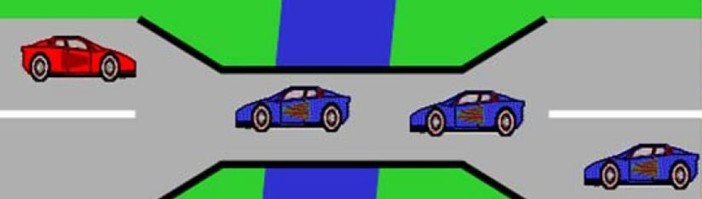
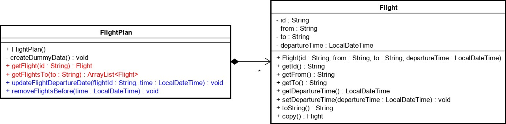
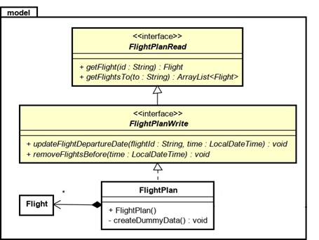
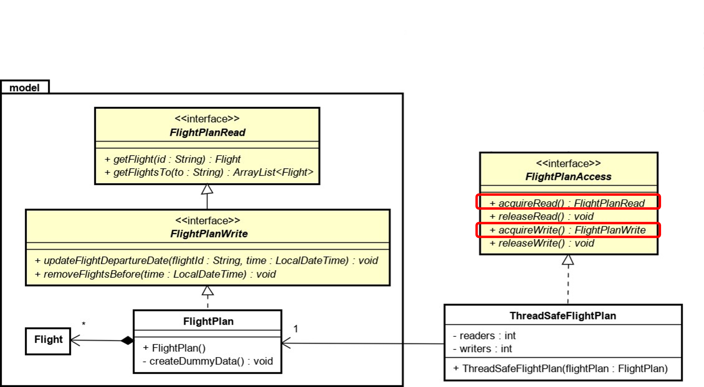

# 16 Exercises: Readers-Writers Problem

## 16.1 Public restroom cleaning

In this exercise we will model a public restroom.

There are the the people using the restroom (*readers*) and the cleaning person (*writer*).

The methods for the restroom follows this interface:


```java
public interface PublicRestRoom
{
    void stepIntoStall();
    void leaveStall();
    void startCleaning();
    void endCleaning();
}
```

Implement a solution, with 1 cleaner and multiple restroom users (feel free to enforce a maximum capacity as well).

Give the cleaner priority, so when they are about to clean or are in the middle of cleaning, noone can enter the restroom, and when the restroom clears out, they start cleaning.

This is an example of the **Writer-Preference** solution strategy.

<blockquote>
  <details>
    <summary>Display solution...</summary>
    
```java
public class PublicRestRoomImplementation implements PublicRestRoom
{

    private int restRoomUsers = 0;
    private boolean cleanerIsWaiting = false;
    private boolean isCleaning = false;

    public synchronized void stepIntoStall()
    {
        // Wait while it's being cleaned or the cleaner is waiting
        while (isCleaning || cleanerIsWaiting)
        {
            try
            {
                wait();
            }
            catch (InterruptedException e)
            {
                e.printStackTrace();
            }
        }
        restRoomUsers++;
    }

    @Override
    public synchronized void leaveStall()
    {
        restRoomUsers--;
        if (restRoomUsers == 0 && cleanerIsWaiting)
        {
            notifyAll(); // Notify the cleaner that they can start cleaning if there are no more people in stalls
        }
    }

    @Override
    public synchronized void startCleaning()
    {
        cleanerIsWaiting = true;
        // Wait until the stalls are empty and it's not currently being cleaned
        while (restRoomUsers > 0)
        {
            try
            {
                wait();
            }
            catch (InterruptedException e)
            {
                e.printStackTrace();
            }
        }
        isCleaning = true;
        cleanerIsWaiting = false;
    }

    @Override
    public synchronized void endCleaning()
    {
        isCleaning = false;
        notifyAll(); // Notify all waiting restroom users that they can enter now
    }
}
```

  </details>
</blockquote>

## 16.2 Single lane bridge

In this exercise we will model a single lane bridge.

Cars can approach from either direction, but will have to stop and wait if there are cars coming from the other direction.

Multiple cars from the same direction are allowed on the bridge at the same time.

The interface for the single lane bridge is this:



```java
public interface Lane
{
    void enterFromTheLeft(); // Allowed only when no cars from the right side are on the lane
    void exitToTheRight(); // A car has exited the lane to the right side
    void enterFromTheRight(); // Allowed only when no cars from the left side are on the lane
    void exitToTheLeft(); // A car has exited the lane to the left side
}
```

Implement a solution that does not give priority to either side (this is neither of the 3 strategies presented)


<blockquote>
  <details>
    <summary>Display solution...</summary>
    
```java
public class SingleLaneBridge implements Lane
{

    private int carsOnLeftSide = 0;
    private int carsOnRightSide = 0;

    @Override
    public synchronized void enterFromTheLeft()
    {
        carsOnLeftSide++;
        while (carsOnRightSide > 0)
        {
            try
            {
                wait();
            }
            catch (InterruptedException e)
            {
                throw new RuntimeException(e);
            }
        }
        //start crossing bridge
    }

    @Override
    public synchronized void exitToTheRight()
    {
        carsOnLeftSide--;
        notifyAll();
        //finished crossing bridge
    }

    @Override
    public synchronized void enterFromTheRight()
    {
        carsOnRightSide++;
        while (carsOnLeftSide > 0)
        {
            try
            {
                wait();
            }
            catch (InterruptedException e)
            {
                throw new RuntimeException(e);
            }
        }
        //start crossing bridge
    }

    @Override
    public synchronized void exitToTheLeft()
    {
        carsOnRightSide--;
        notifyAll();
        //finished crossing bridge
    }
}
```

  </details>
</blockquote>

## 16.3 Single lane bridge

In this exercise we will model a system where customers can book flights, and administrators can update details on flights.

We begin with this UML Class diagram:



Implement everything as shown and create some dummy data for testing purposes.

```java
public class FlightPlan
{
    private ArrayList<Flight> flights;
    
    public FlightPlan()
    {
        flights = new ArrayList<>();  
        createDummyData();
    }

    //...

}
```

Make the `FlightPlan` editable through interfaces as shown in this diagram:



Finally, make the `FlightPlan` thread-safe using the [Proxy](https://viaucdk-my.sharepoint.com/:p:/g/personal/mivi_viauc_dk/EUGB7qts_9RLn2C35XmHCEYB4oIE6OLV06L99PMfDaZNWA?e=kD7tif) Pattern.



Notice how the "acquire"-methods return an interface type.

Implement the Readers-Writers Solution using the "fair" strategy.

```java
public class ThreadSafeFlightPlan implements FlightPlanAccess
{
    private int readers;  
    private int writers;
    private FlightPlan flightPlan;

    public ThreadSafeFlightPlan(FlightPlan flightPlan)
    {
        this.readers = 0;
        this.writers = 0;  
        this.flightPlan = flightPlan;
    }

    //...

}
```

<blockquote>
  <details>
    <summary>Display solution...</summary>

```java
public interface FlightPlanAccess
{
    FlightPlanRead acquireRead();

    void releaseRead();

    FlightPlanWrite acquireWrite();

    void releaseWrite();
}
```
```java
import java.util.ArrayList;

public interface FlightPlanRead
{
    Flight getFlight(String id);

    ArrayList<Flight> getFlightsTo(String to);
}
```
```java
import java.time.LocalDateTime;

public interface FlightPlanWrite
{
    void updateFlightDepartureDate(String flightId, LocalDateTime time);

    void removeFlightsBefore(LocalDateTime time);
}

```
```java
import java.time.LocalDateTime;

public class Flight
{
    private String id;
    private String from;
    private String to;
    private LocalDateTime departureTime;

    public Flight(String id, String from, String to, LocalDateTime departureTime)
    {
        this.id = id;
        this.from = from;
        this.to = to;
        this.departureTime = departureTime;
    }

    public String getId()
    {
        return id;
    }

    public String getFrom()
    {
        return from;
    }

    public String getTo()
    {
        return to;
    }

    public LocalDateTime getDepartureTime()
    {
        return departureTime;
    }

    public void setDepartureTime(LocalDateTime departureTime)
    {
        this.departureTime = departureTime;
    }

    public String toString()
    {
        return "Flight{" +
                "id='" + id + '\'' +
                ", from='" + from + '\'' +
                ", to='" + to + '\'' +
                ", departureTime=" + departureTime +
                '}';
    }

    public Flight copy()
    {
        return new Flight(this.id, this.from, this.to, this.departureTime);
    }
}
```
```java
import java.time.LocalDateTime;
import java.time.Month;
import java.util.ArrayList;
import java.util.List;

public class FlightPlan implements FlightPlanRead, FlightPlanWrite
{
    private ArrayList<Flight> flights;

    public FlightPlan()
    {
        flights = new ArrayList<>();
        createDummyData();
    }

    private void createDummyData()
    {
        flights.add(new Flight("AA123", "New York", "London", LocalDateTime.of(2024, Month.APRIL, 25, 19, 30)));
        flights.add(new Flight("BA456", "Los Angeles", "Tokyo", LocalDateTime.of(2024, Month.APRIL, 26, 11, 0)));
        flights.add(new Flight("CA789", "Chicago", "Paris", LocalDateTime.of(2024, Month.APRIL, 27, 22, 15)));
        flights.add(new Flight("DA321", "San Francisco", "Berlin", LocalDateTime.of(2024, Month.APRIL, 28, 9, 45)));
        flights.add(new Flight("EA654", "Miami", "Sao Paulo", LocalDateTime.of(2024, Month.APRIL, 29, 8, 20)));
    }

    @Override
    public Flight getFlight(String id)
    {
        simulateProcessTakingTime(100);
        for (Flight flight : flights)
        {
            if (flight.getId().equals(id))
            {
                return flight;
            }
        }
        return null;
    }

    @Override
    public ArrayList<Flight> getFlightsTo(String to)
    {
        simulateProcessTakingTime(500);
        ArrayList<Flight> flightsToDestination = new ArrayList<>();
        for (Flight flight : flights)
        {
            if (flight.getTo().equals(to))
            {
                flightsToDestination.add(flight);
            }
        }
        return flightsToDestination;
    }

    @Override
    public void updateFlightDepartureDate(String flightId, LocalDateTime time)
    {
        simulateProcessTakingTime(2500);
        for (Flight flight : flights)
        {
            if (flight.getId().equals(flightId))
            {
                flight.setDepartureTime(time);
                break; // Assuming id is unique, we can exit the loop once the flight is found and updated.
            }
        }
    }

    @Override
    public void removeFlightsBefore(LocalDateTime time)
    {
        simulateProcessTakingTime(1000);
        List<Flight> flightsToRemove = new ArrayList<>();
        for (Flight flight : flights)
        {
            if (flight.getDepartureTime().isBefore(time))
            {
                flightsToRemove.add(flight);
            }
        }
        flights.removeAll(flightsToRemove);
    }

    private void simulateProcessTakingTime(long millis)
    {
        try
        {
            Thread.sleep(millis);
        }
        catch (InterruptedException e)
        {
            e.printStackTrace();
        }
    }

}
```
```java
import java.util.concurrent.locks.ReadWriteLock;
import java.util.concurrent.locks.ReentrantReadWriteLock;

public class ThreadSafeFlightPlan implements FlightPlanAccess {
    private final FlightPlan flightPlan;
    private final ReadWriteLock readWriteLock = new ReentrantReadWriteLock(true); // true to enable fairness

    public ThreadSafeFlightPlan(FlightPlan flightPlan) {
        this.flightPlan = flightPlan;
    }

    @Override
    public FlightPlanRead acquireRead() {
        readWriteLock.readLock().lock();
        return flightPlan;
    }

    @Override
    public void releaseRead() {
        readWriteLock.readLock().unlock();
    }

    @Override
    public FlightPlanWrite acquireWrite() {
        readWriteLock.writeLock().lock();
        return flightPlan;
    }

    @Override
    public void releaseWrite() {
        readWriteLock.writeLock().unlock();
    }
}
```
```java
import java.time.LocalDateTime;

public class Main
{

    public static void main(String[] args)
    {
        // Create a FlightPlan object with dummy data.
        final FlightPlan flightPlan = new FlightPlan();
        final ThreadSafeFlightPlan threadSafeFlightPlan = new ThreadSafeFlightPlan(flightPlan);

        // Create a reader thread that will acquire read access and print flight details.
        Runnable readTask = () ->
        {
            while (true)
            {
                FlightPlanRead readAccess = threadSafeFlightPlan.acquireRead();
                try
                {
                    Flight flight = readAccess.getFlight("AA123");
                    System.out.println(Thread.currentThread().getName() + " - Reading flight: " + flight);
                }
                finally
                {
                    threadSafeFlightPlan.releaseRead();
                }
                waitSomeTime(1000); // Wait before repeating the process.
            }
        };

        // Create a writer thread that will acquire write access and update flight departure time.
        Runnable writeTask = () ->
        {
            while (true)
            {
                FlightPlanWrite writeAccess = threadSafeFlightPlan.acquireWrite();
                try
                {
                    LocalDateTime newDepartureTime = LocalDateTime.now().plusHours(2);
                    writeAccess.updateFlightDepartureDate("AA123", newDepartureTime);
                    System.out.println(Thread.currentThread().getName() + " - Updated flight departure time to: " + newDepartureTime);
                }
                finally
                {
                    threadSafeFlightPlan.releaseWrite();
                }
                waitSomeTime(5000); // Wait before repeating the process.

            }
        };

        Thread[] readThreads = new Thread[5];
        Thread[] writeThreads = new Thread[5];

        for (int i = 0; i < 5; i++) {
            readThreads[i] = new Thread(readTask, "Reader-" + i);
            writeThreads[i] = new Thread(writeTask, "Writer-" + i);

            readThreads[i].start();
            writeThreads[i].start();
        }
    }

    private static void waitSomeTime(long millis)
    {
        try
        {
            Thread.sleep(millis); // Sleep for 'millis' milliseconds.
        }
        catch (InterruptedException e)
        {
            e.printStackTrace();
        }
    }
}
```

  </details>
</blockquote>