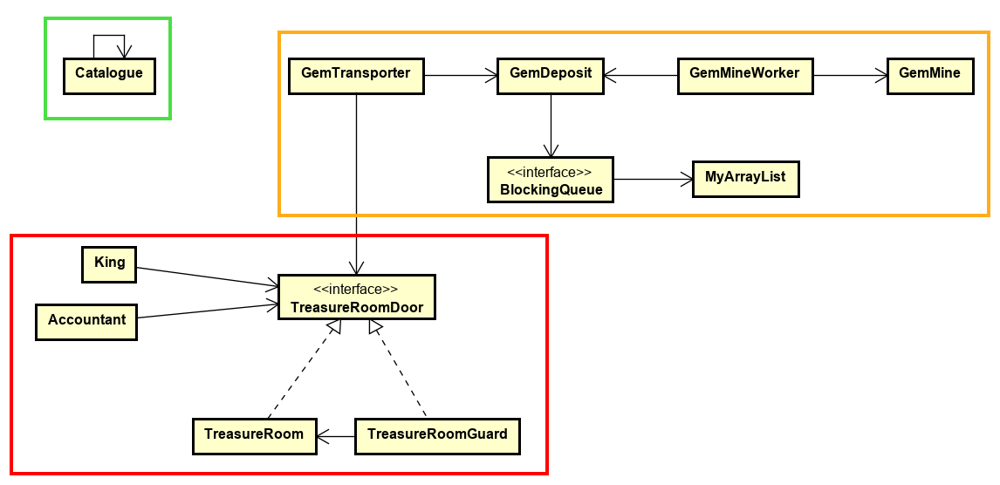

# 18 Assignment 4 - Kingdom simulation

In this assignment you’re going to simulate a kingdom. The ultimate goal is to get `Gems` so the `King` can throw parties.

There are many pieces which must fit together so it is suggested that you do them in the order described.

The following is a very rough class diagram:

## Part 1 (the green rectangle in the diagram)

First, create the `Catalogue` that is to be used by all other classes that want to output anything to the console.

The `Catalogue` class handles logging functionality to keep track of the income and outcome of the kingdom and what actions are taking in the kingdom. 

For instance, when and how much a `GemTransporter` adds to the `TreasureRoom` when the `King` holds a party or cancels it, or when the `Accountants` have calculated the total wealth in the `TreasureRoom`. Or you could include logs for when one or more of them are waiting to enter the `TreasureRoom`.

You should use the [Singleton Pattern](https://viaucdk-my.sharepoint.com/:p:/g/personal/mivi_viauc_dk/EZHvva3YUOZMkN9iu-nGoNEBzYBtuVDubc87C9s4Tk5u5A?e=xiTOW8). 

## Part 2 (the orange rectangle in the diagram)

### `GemMine`
The `GemMine` is responsible for creating [`Gem`](Code/kingdom/Gem.java) objects with different values. 

Create a couple of different types e.g.: `Diamond`, `GoldNugget`, `Jewel`, `Ruby`, `WoodenCoin`, `Cow`, etc…

There should only be one of each type.

You can create the `GemMine` as a [Multiton](https://viaucdk-my.sharepoint.com/:p:/g/personal/mivi_viauc_dk/EZHvva3YUOZMkN9iu-nGoNEBzYBtuVDubc87C9s4Tk5u5A?e=xiTOW8) (kind of):

Let the key in the multiton be the name of the type (like "Diamond") mapping to a specific realization of the `Gem` interface.
(Note that this is not exactly multiton since the (list of) objects is accessed through the `GemMine` but the objects are of type `Gem`. In proper multiton the class holds a list of instances of itself. You could also forgo the `GemMine` and make `Gem` the multiton instead making it hold a list of `Gem` instances. Or you could just let `GemMine` be a simple collection instance that all workers are assigned in their constructor...)

### `GemDeposit`
This is a [Blocking Queue](https://viaucdk-my.sharepoint.com/:p:/g/personal/mivi_viauc_dk/EYjtVdp6yvNBjG1xTpuYdS0BEardZkqsXL3OPVWzBhnk1Q?e=lNnXuP) that is used by the `GemMineWorker` (producer) and `GemTransporter` (consumer).

You have been provided with a `List` implementation called [MyArrayList](Code/MyArrayList/MyArrayList.java). The idea is that you use this `List` for your own implementation of a blocking queue. 

You should use the [Adapter Pattern](https://viaucdk-my.sharepoint.com/:p:/g/personal/mivi_viauc_dk/EUGB7qts_9RLn2C35XmHCEYB4oIE6OLV06L99PMfDaZNWA?e=kD7tif) to convert the MyArrayList into something that acts as a blocking queue. 

### `GemMineWorker`
This should be a `Runnable` class so we can run the behaviour of the `GemMineWorker` in a separate thread.

The `GemMineWorker` must have a `while(true)` loop in which it will get a `Gem` from the `GemMine` and insert this `Gem` into the `GemDeposit` (our blocking queue).

The `GemMineWorker` should have different [Strategies](https://viaucdk-my.sharepoint.com/:p:/g/personal/mivi_viauc_dk/EZHvva3YUOZMkN9iu-nGoNEBzYBtuVDubc87C9s4Tk5u5A?e=xiTOW8) for mining (mine fast, mine slow, only mine specific `Gem` types, etc).Concrete strategies could take more or less time and produce different qualities or quantities of Gems.

### `GemTransporter`
This should also be a `Runnable` class. 

There is quite a distance from the `GemDeposit` to the `TreasureRoom` so the `GemTransporter` does not want to transport only one `Gem` at a time. 

Therefore, the behaviour of the GemTransporter must be strictly as follows:`

 1) Generate a random target number e.g., between 50 and 200 (this is the minimum worth of `Gems` the `GemTransporter` will transport).
 2) Then, continuously get the next `Gem` from the `GemDeposit`. 
 3) Continue to do so until the total worth of all `Gems` is equal to or more than the original target number.
 4) Then, for now, just clear the container (currently we have no place to put them, this will come later!)
 5) Sleep for a little while
 6) Go back to step 1

### Finishing Part 2
In relevant places you should have the `Catalogue` print out what is happening so you can follow along.

In a main method instantiate a `GemDeposit`, start a couple of `GemMineWorkers` (in separate threads with a reference to the `GemDeposit`) and start a couple of `GemTransporters` too.

Run the program and inspect the output.

## Part 3 (the red rectangle in the diagram)

You have been given the class for the [TreasureRoom](Code/kingdom/TreasureRoom.java) and the interface [TreasureRoomDoor](Code/kingdom/TreasureRoomDoor.java). 

Swap out the comments in the methods with relevant calls to the `Catalogue`.

### `TreasureRoomGuard`
The methods in the `TreasureRoom` are very relaxed in their security - everyone can just gain access as they please! 

We want to limit access to the `TreasureRoom`, so we add a `TreasureRoomGuard`. 

Use the [Proxy Pattern](https://viaucdk-my.sharepoint.com/:p:/g/personal/mivi_viauc_dk/EUGB7qts_9RLn2C35XmHCEYB4oIE6OLV06L99PMfDaZNWA?e=kD7tif). 

We also want to implement a solution to the [Readers-Writers Problem](https://viaucdk-my.sharepoint.com/:p:/g/personal/mivi_viauc_dk/ERtQsKGzQr1EubQ9rLCy0yEBLULR7fL1GonwsHO8JqrWTg?e=qsbK4V) in the `TreasureRoomGuard` since he already controls access to the `TreasureRoom`.

You can use any approach to solve the readers-writers problem.

### `GemTransporter`
Go back to the `GemTransporter` and update step 4 - instead of throwing out the `Gems`, the `GemTransporter` should have a reference to the `TreasureRoomDoor` and use it to insert the `Gems` one at a time into the `TreasureRoom`. 

The `GemTransporter` acts as a _**writer**_. 
Remember to acquire write access, execute the action, and then release write access again. 

Make sure the `List` in `GemTransporter` is cleared when done.

### `Accountant`
This class wants to count the total worth of all `Gems` in the `TreasureRoom`
The `Accountant` acts as a _**reader**_ class.  

It must be a `Runnable` class so it can be run in a separate thread. 

The accountant will have a `while(true)` loop in the `run()` method, and will follow these steps strictly: 

 1) Acquire read access
 2) Count the total worth of all `Gems` in the `TreasureRoom` (use sleep to simulate it takes time to count the `Gems`)
 3) Print out the total worth (using the `Catalogue` class)
 4) Release read access
 5) Sleep for a little while

### `King`
Last up is the `King`! 

This is also a `Runnable` class and also acts as a _**writer**_. 

The `King` wants to take out `Gems` from the `TreasureRoom` in order to throw a party. 

The behaviour of the King must follow these steps strictly:

1) The `King` will determine the cost of the party - a random number (could be between 50-150)
2) Then he will acquire write access
3) He starts retrieving the necessary `Gems`, one at a time and inspects their value, adding the total value so far together
4) If the cost cannot be met after retrieving all `Gems`, he will cancel the party and put the `Gems` back (this should include a short sleep to simulate it takes time to get the desired `Gems`)
5) After inspecting all Gems he releases write access
6) If the target is met, he will hold a party. Spend the `Gems` retrieved (remove from the list).
7) After a party, he needs to sleep! Sleep for a while
8) Start over from step 1

Include relevant printouts using the `Catalogue` class.

### Unit testing
The [MyArrayList](Code/MyArrayList/MyArrayList.java) given to you contains a few errors. 

You must unit [test](https://viaucdk-my.sharepoint.com/:p:/g/personal/mivi_viauc_dk/EQvTfI3cDddArBHNfkkzzfoBdKGmAkUY459xwshG9Wck5Q?e=n0bFCR) this class using the (ZOMB(IES)) approach. 

Add a short comment to each test method stating what you are testing, how, and which approach you are using (it’s not strictly necessary that you find the errors, the ArrayList still “works”. In any event, don’t correct them, just document them!).

You can find the documentation of how the class is supposed to work here:
- [MyArrayList JavaDoc](http://ict-engineering.dk/javadoc/MyArrayList/)

### Finishing Part 3
You should be able to expand upon your main method to now include the `TreasureRoom`, `TreasureRoomGuard`, `Accountant`, and `King`. 

Run the program and inspect the console output.